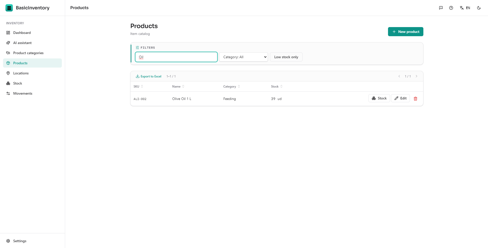
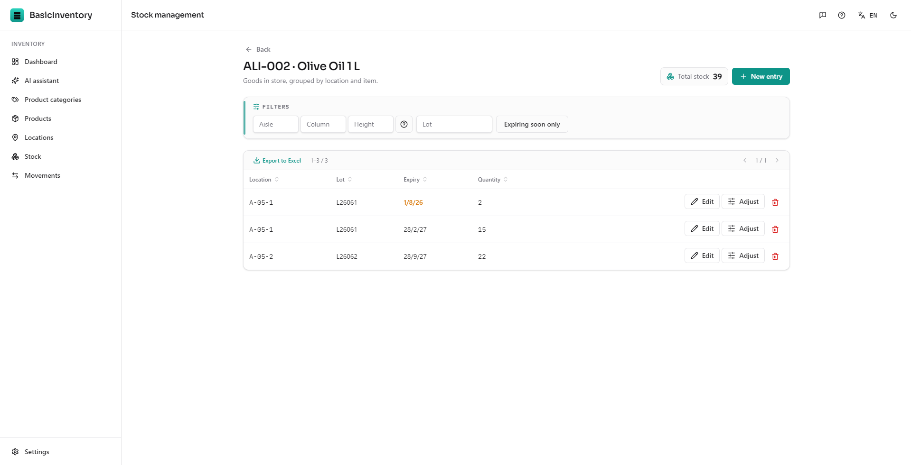
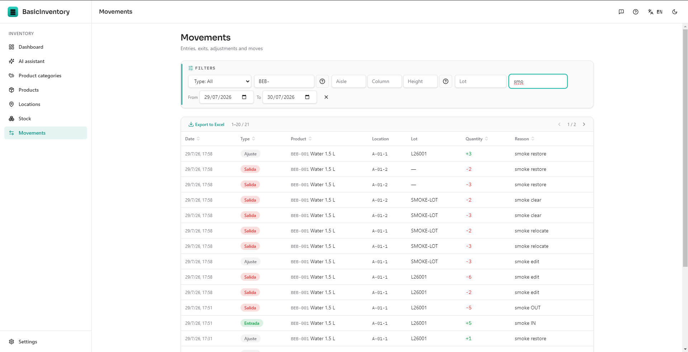
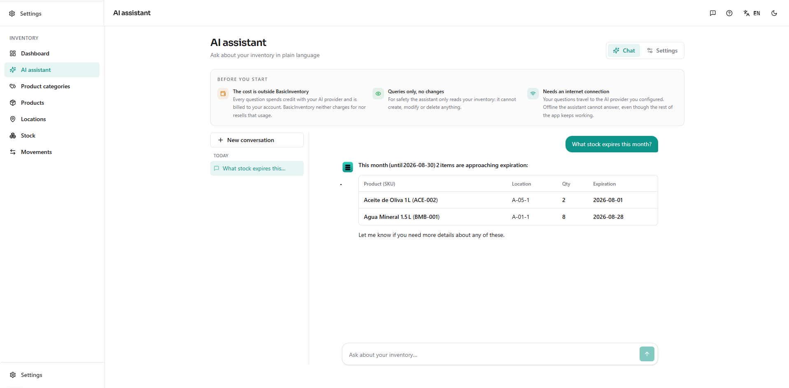

# BasicInventory

**Desktop inventory management for small businesses.**
Fast, offline-first, no subscription required.

[Get it on the Microsoft Store](https://apps.microsoft.com/detail/9N8GQS365ZLM) · [Try the demo](https://demo.basicinventory.app) · [Report a bug](https://github.com/basicinventory-app/basicinventory/issues/new?template=bug_report.yml) · [Request a feature](https://github.com/basicinventory-app/basicinventory/issues/new?template=feature_request.yml) · [Ask a question](https://github.com/basicinventory-app/basicinventory/discussions) · [What's next](#whats-next)

---

## What BasicInventory is

BasicInventory is a Windows desktop application for businesses that need to know
what they have, where it is, and what moved — without a warehouse-scale system
and without a monthly bill.

- **Products, categories and locations** — a catalogue plus a warehouse layout of
  aisle / column / height positions.
- **Stock, two ways** — manage goods **by boxes** (stock per location) or **by
  pallets** (full SSCC detail). One data model, two presentations; switch at any
  time from Settings, with no migration and no data loss.
- **Movements with an audit trail** — entries, exits, adjustments and transfers,
  each recording the item, the quantity, the lot and the location it touched.
  Nothing is edited silently: every change leaves a movement.
- **Lots and expiry dates** — per product, only where you need them, with an
  expiry horizon on the dashboard.
- **Dashboard** — item count, total stock, items below their reorder level, goods
  expiring soon, latest movements.
- **AI assistant (optional)** — ask about your inventory in plain language using
  **your own** AI provider key. See [privacy](#privacy).
- **Excel-friendly export** — every list exports to CSV that opens straight in
  Excel, respecting the filters you applied.
- **One-click backups** — a consistent copy of your database on demand, on close,
  and restorable from the app.

> Not a point of sale, not accounting software: BasicInventory holds no prices,
> no invoices and no customer records.

## Try it first

[**demo.basicinventory.app**](https://demo.basicinventory.app) is the whole
application running in your browser, on a sample warehouse. Register entries and
exits, move stock, filter, export, switch between boxes and pallets, ask the
assistant with your own API key. Nothing to install, no account, and nothing you
type leaves your tab — the demo runs entirely in the browser and its data
disappears when you close it.

What the demo cannot show, because a browser tab is not a PC: backups, settings,
updates and keeping your data. Those are the application.

## Screenshots

| Products | Stock |
| --- | --- |
|  |  |

| Movements | AI assistant |
| --- | --- |
|  |  |

## Get BasicInventory

**[Get it on the Microsoft Store](https://apps.microsoft.com/detail/9N8GQS365ZLM)**

The Microsoft Store is the only place to buy and install BasicInventory. Buying
and installing are one step, it installs with no security warning to click past,
Windows keeps it updated automatically, and the copy is **sold already
licensed** — the purchase is the licence, tied to your Microsoft account, so
there is no key to paste and no activation screen.

Want to see it working before you buy? The browser demo at
[demo.basicinventory.app](https://demo.basicinventory.app) is the whole
application on a sample warehouse — nothing to install.

For a short walkthrough of installing, licensing and updates, see
[How to get BasicInventory](docs/microsoft-store.md).

## System requirements

| | Minimum | Recommended |
| --- | --- | --- |
| Operating system | Windows 10 (64-bit, 21H2) | Windows 11 (64-bit) |
| Processor | Dual-core x64 | Quad-core x64 |
| Memory | 4 GB RAM | 8 GB RAM |
| Disk | 500 MB free | 1 GB free (plus room for backups) |
| Display | 1366 × 768 | 1920 × 1080 |
| Internet | Not required | Required only for the optional AI assistant |

Windows on ARM is not supported. There is no macOS or Linux build.

## Installation

Open the [Store listing](https://apps.microsoft.com/detail/9N8GQS365ZLM) and
select **Get**. Windows downloads, installs and pins it — no security warning,
no administrator rights, nothing to run by hand. It is **already licensed**, so
first launch goes straight to setup: your language, your company name and whether
you manage stock **by boxes or by pallets**, then the guided tour. There is no
key to enter. To remove it later, use **Windows Settings → Apps** like any Store
app.

## Your licence

BasicInventory is sold already licensed on the Microsoft Store, so **there is
nothing to activate**. The licence is your Store purchase, tied to your Microsoft
account: there is no key to paste, no activation screen and no registration.
Reinstall it — or install it on another PC signed in with the same Microsoft
account — and it is licensed again from the Store.

To see everything working before you buy, use the browser demo:
[demo.basicinventory.app](https://demo.basicinventory.app).

## Your data and backups

BasicInventory stores your inventory **only on your computer**, and backs it up
from inside the app, so it never depends on where the files sit. Use
**Settings → Backups → Create backup now**, and a copy is also written
automatically every time you close the application. Backups start out in
`Documents\BasicInventory\Copias de seguridad` — a folder you choose, outside the
application, easy to find, copy or sync — and moving to another computer is:
back up, copy the file across, restore it there.

The live database and logs sit in a per-user application folder that Windows
manages for Store apps. You rarely need the raw path — the in-app backup is the
supported way to reach your data — but **Settings → Errors and diagnostics**
always shows the exact folder in use. Your backups folder, being outside the
application, is never touched by an uninstall.

Full walkthrough: [docs/getting-started.md](docs/getting-started.md).

## Updates

**Updates are automatic.** Windows keeps the Store copy current in the
background, the way it does every Store app; you never fetch or install anything
by hand, and the application makes no update check of its own. Installing an
update keeps your database and settings.

Read [CHANGELOG.md](CHANGELOG.md) to see what changed.

## Reporting a bug

Open a [bug report](https://github.com/basicinventory-app/basicinventory/issues/new?template=bug_report.yml).
The form asks for the version, your Windows version, steps to reproduce, what you
expected, what happened, a screenshot and the log — everything needed to act on
it without a round of questions.

Fastest route from inside the app: **Settings → Errors and diagnostics →
Copy diagnostics**, then paste that into the report. It carries the version, the
system details and the last errors, with your Windows user name removed from the
paths.

Please do not report **security** issues in a public issue — see
[SECURITY.md](SECURITY.md).

## Requesting a feature

Open a [feature request](https://github.com/basicinventory-app/basicinventory/issues/new?template=feature_request.yml),
or float the idea first in
[Discussions → Ideas](https://github.com/basicinventory-app/basicinventory/discussions/categories/ideas).
Describe the problem you are trying to solve rather than the solution you have in
mind — it usually leads somewhere better.

Accepted requests get the `planned` label, so
[that list](https://github.com/basicinventory-app/basicinventory/issues?q=is%3Aissue+is%3Aopen+label%3Aplanned)
is always what is actually coming.

## What's next

There is no published roadmap, and that is deliberate: what gets built next
comes from what the people using BasicInventory ask for, not from a plan written
before anyone had it installed.

- **[Planned](https://github.com/basicinventory-app/basicinventory/issues?q=is%3Aissue+is%3Aopen+label%3Aplanned)** — accepted and coming.
- **[Ideas](https://github.com/basicinventory-app/basicinventory/discussions/categories/ideas)** — under discussion. Upvotes here decide priority.
- **[Milestones](https://github.com/basicinventory-app/basicinventory/milestones)** — what is grouped into the next version.

One thing is already known: keeping the desktop edition a one-off purchase, never
a subscription.

## Support

[SUPPORT.md](SUPPORT.md) explains the channels: **Issues** for bugs and feature
requests, **Discussions** for questions and help. Response times and what to
include are documented there.

## Is this repository the source code?

**No. BasicInventory is closed source and its source code is not public.**

This repository exists so that the product has one public home for:

- bug reports and feature requests,
- documentation and support,
- the community around the product.

The application's source lives in a **private repository**. Pull requests are
therefore not accepted — see [CONTRIBUTING.md](CONTRIBUTING.md) for what *is*
welcome (which is quite a lot: reports, ideas, documentation corrections).

## Buying a licence

BasicInventory is commercial software. One purchase, one perpetual licence for
the version line you bought — no subscription.

**[Get it on the Microsoft Store](https://apps.microsoft.com/detail/9N8GQS365ZLM)**
is the one place to buy it. Buying and installing are one step; the copy is
licensed to your Microsoft account with no key to paste, and it arrives signed
and kept up to date by Windows.

Anything about a purchase — invoices, refunds, volume or reseller enquiries —
goes through the Microsoft Store's own purchase and refund support, which keeps
it attached to your order. See [SUPPORT.md](SUPPORT.md).

The licence terms are in [LICENSE.md](LICENSE.md).

## Privacy

BasicInventory is offline-first and stores your inventory **only on your
computer**, in a local SQLite database.

| What leaves your machine | When | To whom |
| --- | --- | --- |
| Your question plus the inventory data needed to answer it | Only if you enable the AI assistant, only when you ask something | The AI provider **you** configured |
| Nothing else | — | — |

The only thing that ever leaves your machine is an AI question you choose to ask.
The application makes no update check of its own — Windows updates it through the
Store.

- **No telemetry, no analytics, no crash uploads.** Errors are written to a local
  log file; you decide whether to attach it to a report.
- The AI assistant is **off until you configure it**. BasicInventory ships no API
  key: you connect your own provider (OpenAI, Anthropic, Google Gemini,
  OpenRouter) and that provider bills you directly. The key is stored encrypted
  (AES-256-GCM) with a machine-local key kept outside the database, and the app
  only ever shows a masked hint of it.
- The assistant can **read** your inventory, never modify it, and cannot reach
  your configuration, keys, backups or files.

Details: [docs/privacy.md](docs/privacy.md).

## FAQ

<strong>Do I need an internet connection?</strong>

No. Everything except the optional AI assistant works fully offline. Windows
handles updates through the Store in the background.

<strong>Is there a subscription?</strong>

No. You buy a licence for a version line and keep using it. Patch and minor
updates within that line are included.

<strong>Where is my data, and how do I move it to another computer?</strong>

Use **Settings → Backups → Create backup now**, copy the file across, and restore
it from the same screen on the new machine — that is the supported route. The
live database sits in the Store build's own per-user folder, whose exact path is
shown in **Settings → Errors and diagnostics**.

<strong>Can several people use it at the same time?</strong>

Not yet. Today BasicInventory is single-machine. Multi-user and a cloud edition
are not available yet — see [what's next](#whats-next).

<strong>What does "boxes or pallets" mean?</strong>

Two ways of presenting the same stock. In **boxes** mode you see quantities per
location, item, lot and expiry — no pallet concept anywhere. In **pallets** mode
you also see each pallet, its SSCC code and pallet-level actions. Switching is
instant and migrates nothing.

<strong>Does the AI assistant cost extra?</strong>

The assistant itself is included, but the AI provider you connect charges you for
each question on your own account. BasicInventory neither resells nor marks up
that usage, and the app says so on the screen.

<strong>Do I need to activate a licence key?</strong>

No. The Microsoft Store copy is sold already licensed: the purchase is the
licence, tied to your Microsoft account. There is no key to paste and no
activation screen — first launch goes straight to setup.

<strong>Will you support macOS or Linux?</strong>

Not in the current line, and not promised for one — add your vote in
[Discussions](https://github.com/basicinventory-app/basicinventory/discussions).

<strong>Can I get the source code?</strong>

No. The source is private. Source-available licensing for specific commercial
arrangements can be discussed privately — email the address in
[SUPPORT.md](SUPPORT.md).

## Licences

- **The application**: proprietary. Terms in [LICENSE.md](LICENSE.md).
- **This documentation**: free to read, quote and translate with attribution;
  see the notice at the end of [LICENSE.md](LICENSE.md).
- **Third-party components**: BasicInventory bundles open-source components
  (Electron, Node.js, Prisma, React, Next.js and others). Their licences and
  copyright notices ship with the application and are listed in
  [docs/third-party-licenses.md](docs/third-party-licenses.md).

---

**[Get it on the Microsoft Store](https://apps.microsoft.com/detail/9N8GQS365ZLM)** ·
**[Changelog](CHANGELOG.md)** ·
**[What's next](#whats-next)** ·
**[Support](SUPPORT.md)** ·
**[Security](SECURITY.md)**

